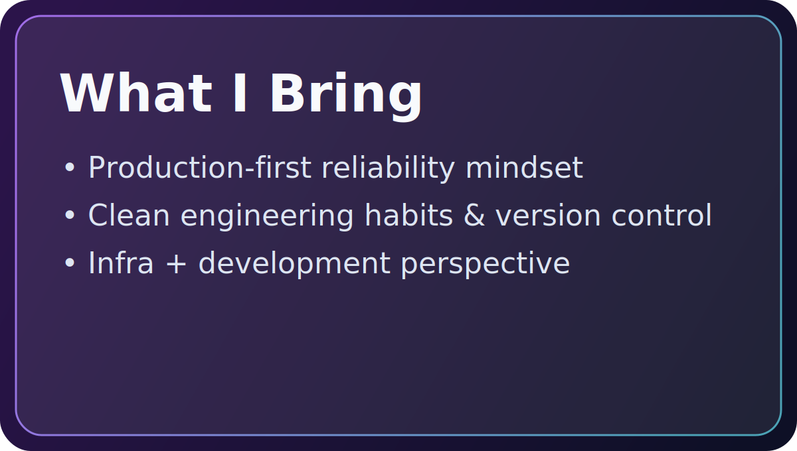
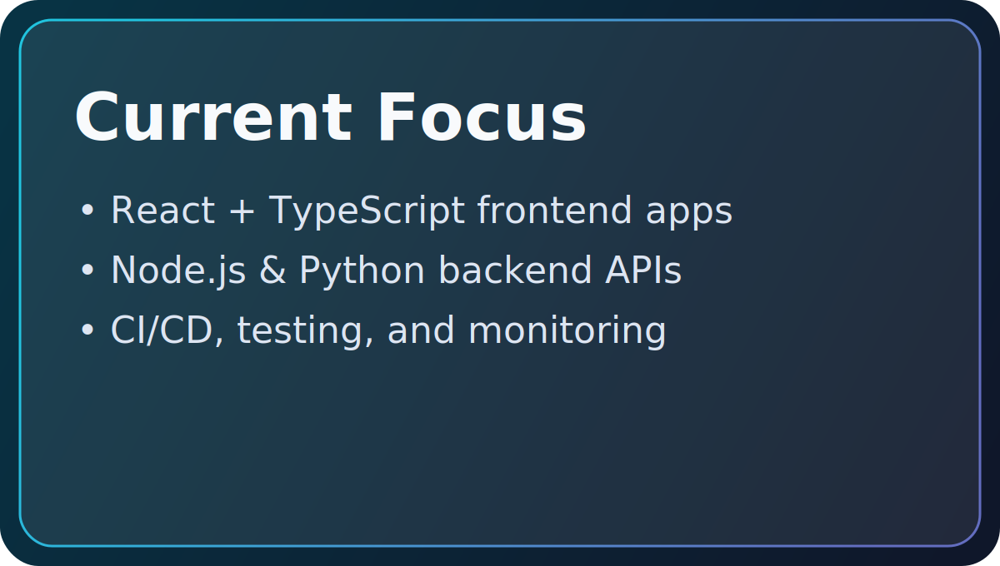
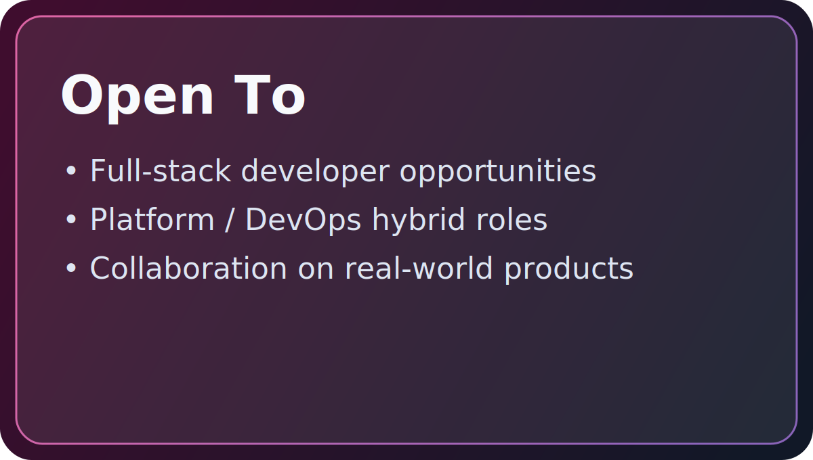
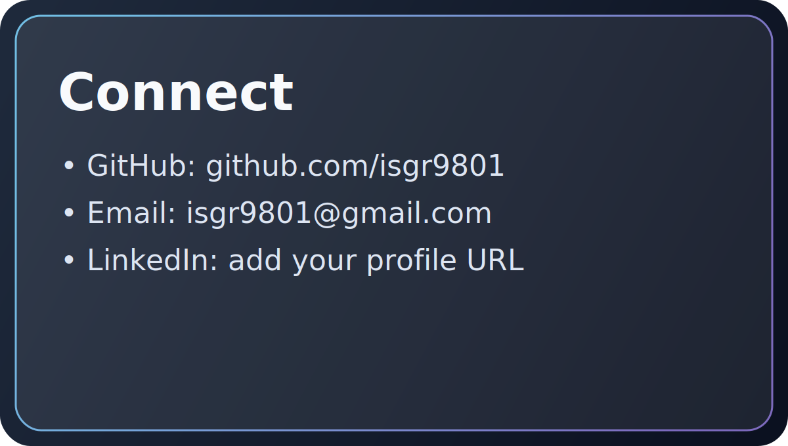

# Hi, I'm Sagar

Linux Administrator with 2.5 years of hands-on experience in production systems, operations reliability, and troubleshooting. I am now focused on becoming a full-stack engineer who can design, build, and ship web applications that meet industry standards for performance, security, and maintainability.

## Professional Summary

- 2.5 years of Linux administration experience across real-world environments.
- Strong foundation in system operations, deployment workflows, and incident handling.
- Transitioning into full-stack web development with a product and delivery mindset.
- Interested in building end-to-end applications from infrastructure to user experience.

## What I Bring

	

## Current Focus

	

# Tech Stack:
                                      

## Career Direction

My goal is to grow into an engineer who can independently take a product from idea to production, while ensuring strong architecture, secure defaults, and smooth user experience.

## Open To

	

## Connect

	

