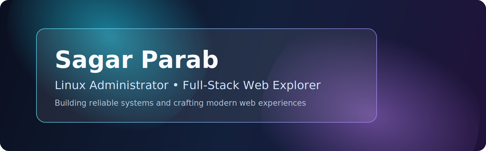

# Hi, I'm Sagar

Linux Administrator with 2.5 years of hands-on experience in production systems, operations reliability, and troubleshooting. I am now focused on becoming a full-stack engineer who can design, build, and ship web applications that meet industry standards for performance, security, and maintainability.

## Professional Summary

- 2.5 years of Linux administration experience across real-world environments.
- Strong foundation in system operations, deployment workflows, and incident handling.
- Transitioning into full-stack web development with a product and delivery mindset.
- Interested in building end-to-end applications from infrastructure to user experience.

## What I Bring

- Production-first thinking: reliability, observability, and operational discipline.
- Clean engineering habits: documentation, version control, and iterative delivery.
- Cross-domain perspective: infrastructure + development for faster shipping cycles.

## Current Focus

- Building modern frontend applications with React and TypeScript.
- Developing backend APIs with Node.js and Python.
- Strengthening system design, testing practices, and CI/CD workflows.
- Learning to deliver web products to production with quality gates and monitoring.

## Core Skills

**Systems & Ops**

- Linux administration
- Shell scripting
- Server setup and troubleshooting
- Performance and uptime awareness

**Web Development Journey**

- HTML, CSS, JavaScript, TypeScript
- React, Node.js, Express
- REST APIs, authentication flows
- GitHub Actions, Docker (learning and applying)

## Career Direction

My goal is to grow into an engineer who can independently take a product from idea to production, while ensuring strong architecture, secure defaults, and smooth user experience.

## Open To

- Full-stack developer opportunities
- Platform / DevOps + development hybrid roles
- Collaborations on real-world web products

## Connect

- GitHub: [isgr9801](https://github.com/isgr9801)
- LinkedIn: _Add your LinkedIn URL here_
- Email: isgr9801@gmail.com
